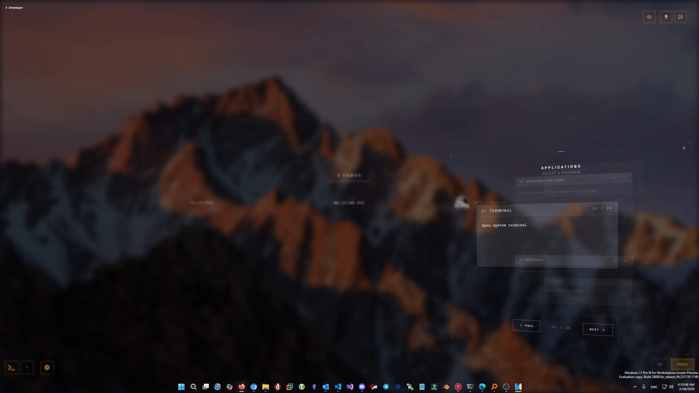

# 3 Tomoe UI Desktop Experience

A dynamic desktop experience featuring live 3D shader wallpaper and image gallery, quick-launch menus, and overlay widgets for system stats, weather, and app switching.

## Preview


[More Screenshots](docs/architecture.md)

## Quick Start

### Prerequisites

- Python 3.8+
- A supported wallpaper engine (see [Wallpaper Engine](#wallpaper-engine) below)

### Installation

```bash
pip install -r requirements.txt
```

### Running the Application

Start both servers (in separate terminals):

```bash
# UI + admin panel (port 5000)
python config_manager.py

# Runtime API (port 5055)
python 3tomoe.py
```

### Access Points

- Main wallpaper: `http://localhost:5000/`
- Admin panel: `http://localhost:5000/admin`
- Runtime API: `http://localhost:5055/`

## Features

- **Wallpaper Modes**: Shader (3D) with presets or image/video wallpaper
- **Launcher Menus**: Quick access to apps, run dialog, and window switcher
- **Overlay System**: Widgets and menus that appear over normal windows
- **System Widgets**: Live CPU/GPU/RAM stats, weather, system info
- **Window Switcher**: Browse and switch between open windows

## Keyboard Shortcuts

| Shortcut | Action |
|----------|--------|
| `Alt+R` | Open run dialog |
| `Alt+3` | Open app launcher (menu3) |
| ``Alt+` `` | Open settings/sysinfo |
| `Alt+W` | Show overlay only |
| `Arrow Up/Down` or `J/K` | Navigate menus |
| `Enter` | Select |
| `Escape` | Close menu |
| `1-9` | Jump to card by number |

## Wallpaper Engine

Developed and tested with [wv2wall](https://github.com/superswan/wv2wall), a Windows wallpaper engine using WebView2.

For full overlay support, use the [3tomoe-overlay branch](https://github.com/superswan/wv2wall/tree/3tomoe-overlay).

## Admin Panel

Access at `http://localhost:5000/admin` to:
- Manage presets and backgrounds
- Configure menu items and app shortcuts
- Adjust settings

Enable developer mode from the top-right controls for additional tuning options.

## Just Want the XMB Shader?

Download `xmb-shader.html` from this repository and set it as your wallpaper in any HTML-supported wallpaper software like [Lively Wallpaper](https://github.com/rocksdanister/lively).

## Documentation

- [Architecture Overview](docs/architecture.md) - Technical details about the system

## License

MIT