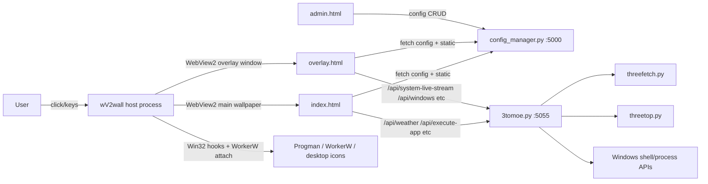

# 3Tomoe + wv2wall Architecture

## Purpose and scope

This document describes the current runtime architecture of the integrated system:

- `wv2wall` (`Z:\weeds profile\Documents\Open Code Projects\wv2wall`) as the Windows host and wallpaper engine.
- `3tomoe-desktop-ui` (`Z:\weeds profile\Documents\Open Code Projects\3tomoe-ui\3tomoe-desktop-ui`) as the web UI plus Python services.

The goal is to explain how desktop embedding, input/focus, overlay behavior, frontend modules, and backend APIs fit together in the current codebase.

## System overview

At runtime, the system is a desktop-composited web app with one native host and two Python services:

- Native host (`wv2wall`, C# WinForms + WebView2) embeds the main UI behind desktop icons and owns global input hooks.
- UI/config service (`config_manager.py`, Flask, port `5000`) serves `index.html`, `overlay.html`, `admin.html`, static assets, and config APIs.
- Runtime service (`3tomoe.py`, `ThreadingHTTPServer`, default port `5055`) serves live system/weather/launch/window APIs.

`wv2wall` currently starts with `WallpaperContext("http://127.0.0.1:5000")`, so the rendered page is typically the Flask-served frontend, while frontend API calls are routed by `appConfig.apiBase` (default `http://127.0.0.1:5055`) to the runtime service.

## Runtime topology

## Host architecture (`wv2wall`)

### Core classes

- `Program` (`wv2wall/Program.cs`): app entry point; starts `WallpaperContext` with base URL.
- `WallpaperContext`: tray app context, mode/monitor orchestration, global mouse/keyboard hooks, overlay lifecycle, settings persistence.
- `DeskForm`: one wallpaper surface (WinForms `Form` + `WebView2`) attached behind desktop icons via WorkerW.
- `OverlayForm` (`wv2wall/OverlayForm.cs`): topmost transparent overlay WebView2 window for modals/widgets over normal windows.

### Desktop embedding model

`DeskForm` uses WorkerW injection:

1. Find `Progman`.
2. Send undocumented message `0x052C` to spawn/resolve WorkerW.
3. Locate the desktop host (`WorkerW` or fallback).
4. `SetParent` DeskForm into that host.
5. Position with `SetWindowPos(HWND_BOTTOM, SWP_NOACTIVATE | SWP_SHOWWINDOW)`.

This keeps the web wallpaper behind desktop icons while still receiving routed input.

### Multi-monitor modes

`WallpaperContext` supports three monitor strategies:

- `Span`: one `DeskForm` sized to `SystemInformation.VirtualScreen`.
- `All`: one `DeskForm` per monitor bounds.
- `Single`: one `DeskForm` on selected monitor index.

Persistent settings (stored under user app data, `settings.json`):

- `MonitorMode`
- `SelectedMonitor`
- `MainMonitor` (for overlay anchoring; `-1` means auto-primary)

### Input and focus architecture

The host installs global low-level hooks:

- `WH_MOUSE_LL` for mouse routing and desktop behavior arbitration.
- `WH_KEYBOARD_LL` for keyboard routing and overlay shortcuts.

#### Mouse pipeline (current behavior)

When pointer is over desktop/wallpaper space:

- Right-click is passed through to Explorer so normal desktop context menu still works.
- Desktop icon hit-testing uses `SysListView32` + remote `LVM_HITTEST`; if over icon, host passes through and does not steal interaction.
- Non-icon left click marks wallpaper focused, deselects desktop icons (`LVM_SETITEMSTATE`), cancels shell menus, and forwards events to WebView renderer window (`Chrome_RenderWidgetHostHWND`).
- Wheel is forwarded via WebView2 DevTools `Input.dispatchMouseEvent` (`mouseWheel`) for reliable scrolling.

Recent focus fix in this flow:

- On wallpaper background left/middle click, host now resolves root ancestor and calls `SetForegroundWindow(root)`.
- This aligns focus behavior with native desktop wallpaper clicks and restores hotkey reliability after switching from other programs.

#### Keyboard pipeline (current behavior)

Overlay shortcuts (when overlay is enabled):

- `Alt+R` -> overlay run dialog
- `Alt+3` -> overlay app launcher (`menu3`)
- ``Alt+` `` -> overlay settings/sysinfo path
- `Alt+W` -> overlay show-only mode

When overlay is visible, keyboard is intended to go naturally to overlay focus target, with explicit Escape handling.

When overlay is not visible:

- Host checks desktop/wallpaper focus state (`_isWallpaperFocused` + dynamic foreground checks).
- Includes a 1500ms grace window after wallpaper click (`_lastWallpaperInteractionTick`) so transient non-activating desktop windows do not break key routing.
- System-critical keys (Win keys, PrintScreen, Alt+Tab) are passed through to OS.
- Content keys are posted to WebView and swallowed.

### Overlay lifecycle (`OverlayForm`)

`WallpaperContext` lazy-creates one `OverlayForm` and subscribes to:

- `OverlayVisibilityChanged(bool)`
- `OverlayBlurRequested(double)`

Overlay behavior:

- On show: host sets wallpaper UI hide mode (`SetOverlayHideMode(true)`) across DeskForms.
- On hide: previous wallpaper UI-hidden state is restored.
- Blur requests from overlay JS are debounced (30ms) and propagated to all DeskForms via CSS/script bridge (`SetOverlayBackgroundBlur`).

### Host <-> overlay message contract

From host C# to overlay JS (`PostWebMessageAsJson`):

- `{ "type": "open", "modal": "run" | "menu3" | "sysinfo" }`
- `{ "type": "show-only" }`

From overlay JS to host C# (`window.chrome.webview.postMessage`):

- `"hide"` / `"close"` to dismiss overlay window
- `"overlay-blur:<value>"` or `{ "type": "overlay-blur", "blur": <number> }`

OverlayForm uses a multi-step focus sequence (window activation + WebView focus + trusted click injection via `SendInput`) so modal text inputs can receive keyboard immediately.

## Frontend architecture (`3tomoe-desktop-ui`)

### Pages and runtime roles

- `index.html`: main wallpaper UI page (shader/image modes, home screen, menu modals).
- `overlay.html`: overlay-only page (modals/widgets over normal windows, transparent body).
- `admin.html`: config manager UI.

The frontend is modular ES modules in `static/js`.

### Frontend module map

Main-page path:

- `main.js`: startup orchestration.
- `shader-background.js`: WebGL/Three.js shader renderer and preset application.
- `theme-switcher.js`: top-right controls (preset chooser, image-mode dim/background selector, UI visibility toggle).
- `menu.js`: settings card carousel.
- `menu3.js`: applications carousel + window switcher mode.
- `menu3run.js`: run dialog with Start Menu search/autocomplete.
- `modals.js`: about/system/image modal logic and system info caching.
- `developer-panel.js`: lil-gui panel for shader/UI/overlay widget settings; persists to localStorage and `PATCH /api/config/site`.
- `router.js`: hash route and keyboard binding glue.
- `ui-utils.js`: shared helpers (API base, execute app, weather, time, logs, toast, etc).

Overlay-page path:

- `overlay-main.js`: overlay bootstrap, host message listener, modal open/close policy, viewport-aware chrome alignment.
- `overlay-widgets.js`: widget manager (3top, 3fetch, Sense weather, image widgets), persistence, SSE streaming (`EventSource`) with fetch fallback, drag layering.
- `quickmenu.js`: overlay quick actions menu and confirmations.

Shared helper:

- `dragmove.js`: drag utility used by modal/widget systems.

### Styling architecture

- `static/css/shader-background.css`: primary main-page stylesheet (cards, modals, home UI, 3D/image mode styling, status line variants).
- `static/css/overlay.css`: overlay-specific compositing, widget, quickmenu, and overlay UI styles.
- `static/css/style.css`: instrument-panel layout styles (legacy/alternate UI layer still in repo).
- `static/css/rotate.css`: small rotation animation utility.

### Frontend state and persistence

Configuration sources:

- `config.json` (authoritative project config, served by Flask side).
- `localStorage` runtime state (theme/preset/mode/visibility/widget settings, positions, etc).
- `sessionStorage` for transient overlay/widget data.

Important persisted state patterns:

- `developerSettings` object is central for many UI and overlay widget controls.
- Modal positions stored individually (`menuLeft/menuTop`, `menu3Left/menu3Top`, etc).
- Overlay dim and show-only flags maintained in local/session storage.

### Preset and theme pipeline

- `config.json` defines preset mappings (`presets`, `defaultPreset`) and UI defaults.
- `config.js` loads config and builds `availablePresets` lookup.
- `shader-background.js` applies shader uniforms from preset payloads.
- `theme-switcher.js` drives end-user preset/background/dim selection and dispatches `applyPreset`/`presetChanged` events.
- `developer-panel.js` provides deep tweak controls and persists UI/overlay tuning to local storage plus `PATCH /api/config/site`.

## Backend architecture (`3tomoe-desktop-ui`)

### Service A: config and admin (`config_manager.py`, Flask, port 5000)

Responsibilities:

- Serve main pages (`/`, `/admin`, static files, `/presets/*`).
- Manage config CRUD (`/api/config`, `/api/config/site`, menu/app/preset reorder/edit APIs).
- Manage preset files and media uploads (logo/home/background/background library).
- Provide Start Menu search and icon caching endpoint for run dialog (`/api/start-menu-apps`).

### Service B: runtime APIs (`3tomoe.py`, ThreadingHTTPServer, port 5055)

Responsibilities:

- `GET /api/system-info` via `threefetch.py`.
- `GET /api/system-live` and `GET /api/system-live-stream` via `threetop.py`.
- `GET/POST /api/execute-app` command launch with allowlist/runAnyCommand policy.
- `GET /api/windows`, `POST /api/windows/focus` for window switcher.
- `GET /api/weather` proxy/cache to Open-Meteo.
- `GET /api/logs` for log overlay.

### Data providers

- `threefetch.py`: mostly static host info (OS, CPU/GPU names, memory summary, disks, uptime, etc).
- `threetop.py`: live CPU/GPU/RAM/process metrics with psutil + Win32/WMIC/NVIDIA fallbacks.

## Key end-to-end workflows

### Startup flow

1. Services are started externally (typically both Python servers).
2. `wv2wall` starts and opens `WallpaperContext` at base URL (`5000` by default).
3. `DeskForm` instances attach to WorkerW according to selected monitor mode.
4. `index.html` bootstraps (`main.js`) and loads config/presets/backgrounds.
5. Frontend uses `appConfig.apiBase` to call runtime APIs (`5055` by default).

### Wallpaper click and focus flow

1. Global mouse hook detects click over desktop/wallpaper.
2. If over desktop icon (`SysListView32` hit), pass through untouched.
3. If wallpaper background, set wallpaper focused, set foreground root window, route event to WebView renderer.
4. Keyboard hook routes keys to wallpaper WebView while focused and within transition grace window.

### Overlay hotkey flow

1. Keyboard hook detects overlay shortcut (Alt combos).
2. Host ensures overlay form exists and applies anchor viewport.
3. Host posts open/show-only message to overlay page.
4. `overlay-main.js` opens target modal/widget context.
5. Overlay can request blur updates; host applies blur to wallpaper surfaces.
6. On close/hide message, host hides overlay and restores previous foreground window.

## Integration contracts and assumptions

- `wv2wall` assumes a valid web entrypoint at the configured base URL.
- Frontend assumes config service availability for `config.json` and admin-backed config APIs.
- Runtime interactions (weather/system/window/process/launch) assume runtime API availability (`apiBase`, default `5055`).
- Overlay interop assumes WebView2 host environment (`window.chrome.webview`) when running inside `OverlayForm`; browser-only fallback behavior is limited.

## Repository map (relevant)

`wv2wall` repo:

- `wv2wall/Program.cs` - main host context, hooks, monitor modes, DeskForm.
- `wv2wall/OverlayForm.cs` - overlay host window and JS bridge.
- `wv2wall/Form1.cs` - legacy form.
- `docs/architecture.md` - this document.

Frontend/service repo:

- `3tomoe.py` - runtime API server (`5055`).
- `config_manager.py` - UI/admin/config Flask server (`5000`).
- `index.html`, `overlay.html`, `admin.html`.
- `static/js/*` - frontend modules.
- `static/css/*` - styling layers.
- `threefetch.py`, `threetop.py` - system data providers.
- `config.json` - core runtime configuration.

## Current-state notes

- Focus handling is intentionally conservative to preserve normal desktop icon behavior and Explorer context menus.
- Overlay and wallpaper are separate WebView2 surfaces with different z-order and interaction goals.
- The architecture is modular but operationally coupled through config keys, localStorage conventions, and host/overlay message contracts.
